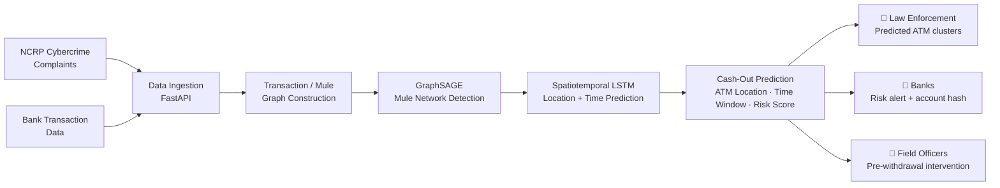

# NEXUS 🧠🔗
### Predictive Cash-Out Interception for Cybercrime Complaints

<p align="center">
  
  
  
  
  
</p>

> **Team PYTORCHERERS** | Smart India Hackathon 2026
> Problem Statement: *Development of a Predictive Analytics Framework for Cybercrime Complaints to Forecast Likely Cash Withdrawal Locations in Advance, Enabling Generation of Actionable Intelligence for Timely and Proactive Cybercrime Intervention.*

---

## 🚨 The Problem

India loses an estimated **₹22,845 crore a year** to cyber fraud. Over **8,000 cybercrime complaints** are filed on the NCRP portal *every single day* — but by the time a complaint is filed, investigated, and acted on, the stolen money has usually already been withdrawn through a chain of mule accounts.

The system today is **reactive**:

```
Fraud happens → Complaint filed (hours later) → Mule chain (4-6 hrs) → Cash withdrawn (12-48 hrs) → Money gone forever
```

There is currently **no mechanism that predicts where stolen money will be withdrawn before it happens.** That gap — not a lack of suspicious-account detection, but a lack of *cash-out location prediction* — is what NEXUS closes.

## 💡 What NEXUS Does

NEXUS is a predictive intelligence layer that sits on top of India's existing cybercrime infrastructure (NCRP, I4C, CCTNS, bank systems) and answers one question early enough to matter:

**"Given this complaint and this mule account chain, *where* and *when* will the money likely be withdrawn?"**


```
Fraud happens → Complaint ingested (seconds) → Trace & predict (AI model) → Alert & intercept (6-24 hr window) → Frozen / recovered
```

Instead of only flagging suspicious accounts after the fact, NEXUS predicts the **specific ATM / bank branch cash-out location and a 6–24 hour time window**, and pushes that as an actionable alert to police, banks, and I4C — while there's still time to act.

## 🏗️ How It Works



**Pipeline stages:**
1. **Ingest** — NCRP complaint details, linked transactions, and mule account signals via FastAPI
2. **Graph** — Build a victim → mule account → mule account transaction graph
3. **Detect** — GraphSAGE identifies suspicious mule networks from relationship + transaction patterns
4. **Predict** — A spatiotemporal LSTM combines KYC geography, ATM density, and withdrawal-time patterns to output a likely cash-out **location + 6–24 hr time window + risk score**
5. **Alert** — Federated, privacy-preserving alerts (raw PII never leaves the source institution) pushed via SMS/Email/REST webhooks to police, banks, and I4C simultaneously

## 🔑 Why This Is Different

Most existing tooling (including MuleHunter-style systems on the I4C portal) stops at *flagging suspicious accounts*. NEXUS goes a step further:

- **Predicts the withdrawal point**, not just the suspicious account
- Combines **graph-based mule tracing + location/time prediction** in one pipeline
- **Self-learning** — retrains on past case outcomes to improve over time
- **Integrates with existing infrastructure** (NCRP, CFCFRMS, Samanvaya, Suspect Registry, CCTNS) rather than asking institutions to adopt a new system from scratch
- **Explainable alerts** — every prediction ships with the linked complaints, transaction path, and confidence score, not a black-box flag

## 🧰 Tech Stack

| Layer | Technology |
|---|---|
| Frontend | React.js + Deck.gl |
| Backend | FastAPI (Python) |
| AI / ML | PyTorch Geometric, GraphSAGE, LSTM |
| GIS & Data | PostGIS, OpenStreetMap, Leaflet |
| Alerts | REST Webhooks, SMS, offline-capable PWA |
| Deployment | Docker, NIC Cloud / MeghRaj |

## ✅ Feasibility (why this isn't vaporware)

We deliberately designed NEXUS to be the **one new component** in an otherwise existing pipeline:

- Integrates with **5 already-live I4C systems** (NCRP, CFCFRMS, Samanvaya, Suspect Registry, CCTNS) — only the predictive engine is new
- Built on data that already exists: 8,000+ daily NCRP complaints, real-time CFCFRMS mule flags, 32 lakh Suspect Registry accounts, 2.5 lakh publicly available RBI ATM locations
- CCTNS already covers 99.9% of police stations; 62 banks are already onboarded to the I4C portal — no new data-sharing agreements required for the ATM layer
- New infrastructure needed: **one** NIC-hosted API server, Dockerized and cloud-ready in under 2 weeks

**Known challenges and how we're addressing them:**

| Challenge | Mitigation |
|---|---|
| No access to real NCRP data during prototyping | Synthetic data (PaySim2-style) + public NCRP open data; formalize I4C access via MoU post-hackathon |
| Cold start on new fraud typologies | Rule-based fallback + human-in-the-loop review + continuous retraining |
| Alert latency (<30 min target) | Real-time webhook alerts + SLA monitoring + live countdown dashboard |
| Privacy / DPDP Act 2023 compliance | SHA-256 hashed identifiers, differential privacy, no raw PII leaves the source institution |

## 📈 Potential Impact

- **6–24 hour prediction window** where today there is effectively zero warning
- Targets recovery of a share of the **~₹1,200 crore/month** currently lost with no prediction capability
- Converts 8,000+ raw daily complaints into **prioritized, actionable alerts** instead of an undifferentiated queue
- Extends ATM hotspot intelligence from **18 tracked locations today to nationwide, real-time coverage**
- Enables **cross-state fraud tracking** by following money movement rather than static jurisdiction boundaries

## 📦 Product Status

**Prototype stage.** Core AI pipeline (graph construction → GraphSAGE → LSTM prediction) has been demonstrated on synthetic/sample data. I4C system integration and field pilot validation are the next steps, not yet complete — we're presenting this as a validated architecture and working core, not a deployed production system.

## 🚀 Getting Started

> Setup instructions — replace with your actual run steps once finalized.

```bash
# Clone the repo
git clone https://github.com/<your-username>/nexus-sih2026.git
cd nexus-sih2026

# Backend
cd backend
pip install -r requirements.txt
uvicorn main:app --reload

# Frontend
cd frontend
npm install
npm run dev
```


## 📚 References

- [National Cyber Crime Reporting Portal (NCRP)](https://cybercrime.gov.in)
- [PIB — Rise of AI-Driven Cybercrime & Measures to Curb Financial Losses](https://www.pib.gov.in/PressReleasePage.aspx?PRID=2158408)
- [IMPRI — I4C: Strengthening India's Response to Cyber Fraud](https://www.impriindia.com/centres/center-for-ict-for-development/indian-cyber-crime-coordination-centre-i4c-strengthening-indias-response-to-cyber-fraud/)
- [MediaNama — 62 Banks Join India's I4C Portal](https://www.medianama.com/2026/02/223-i4c-portal-banks-onboarded-amit-shah-mulehunter-ai/)
- [SPRF — AI Policing and Surveillance in India](https://sprf.in/ai-policing-and-surveillance-in-india/)

---

<p align="center"><i>Built for Smart India Hackathon 2026 — Problem Statement SIH26184</i></p>
