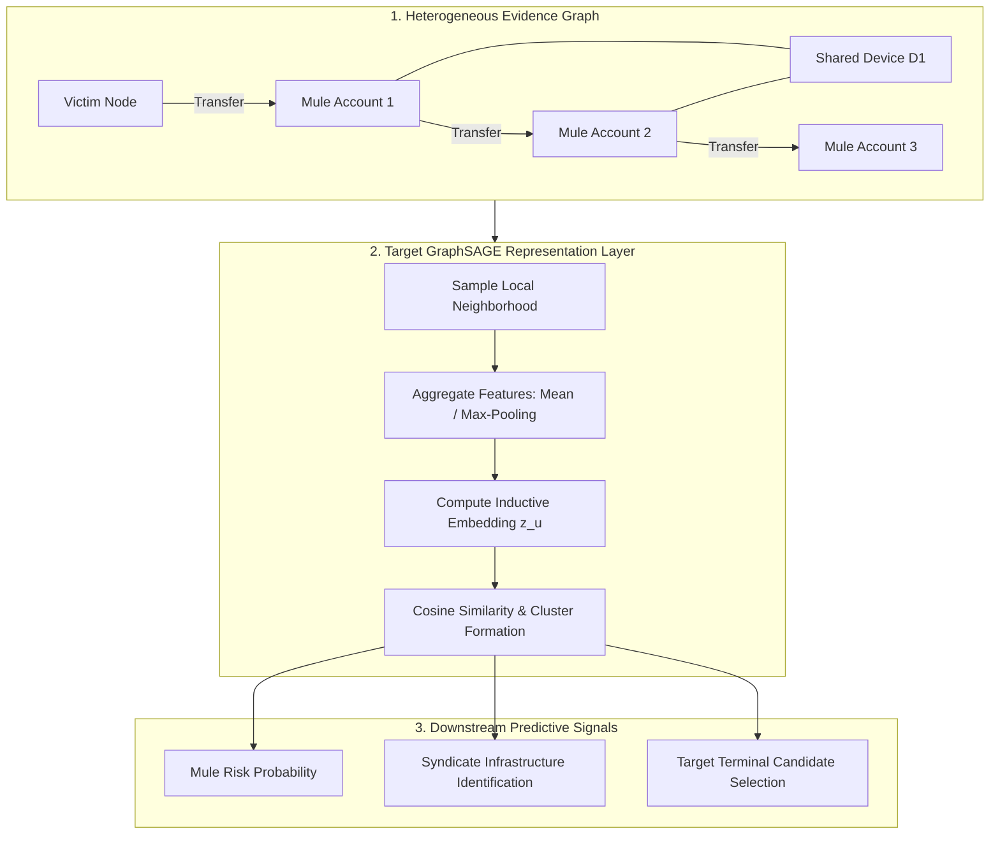
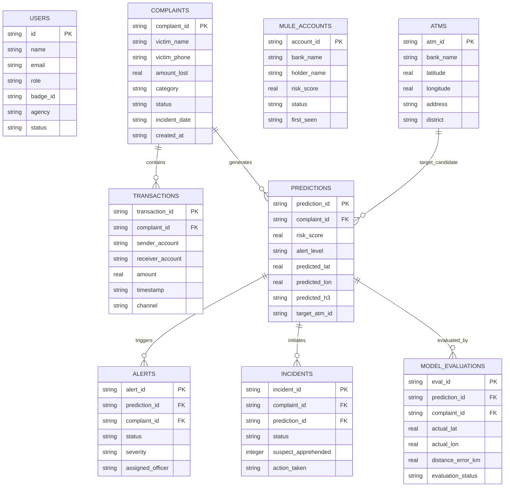

# NEXUS

## AI-Powered Predictive Cybercrime Intelligence & Proactive Intervention Platform

<p align="center">
  
  
  
  
  
  
</p>

---

> **Team PYTORCHERERS** | Smart India Hackathon 2026  
> **Problem Statement SIH26184:** *Development of a Predictive Analytics Framework for Cybercrime Complaints to Forecast Likely Cash Withdrawal Locations in Advance, Enabling Generation of Actionable Intelligence for Timely and Proactive Cybercrime Intervention.*

---

### Executive Vision

> **"Turn fragmented cybercrime evidence into actionable predictive intelligence before the money disappears."**

NEXUS transforms cybercrime complaint records and financial evidence from static administrative records into a real-time, predictive decision-support pipeline for law enforcement agencies, nodal bank security desks, and national command centers.

```
Complaint Intelligence
  ├──► Graph Intelligence (GraphSAGE / GNN)
  ├──► Fraud Risk & Behavioral Analysis (XGBoost / SHAP)
  ├──► Temporal Intelligence (Sequence & Window Analysis)
  ├──► Geographic Prediction (Spatio-Temporal Regressors)
  ├──► Cash-Out Intelligence (H3 Hexagonal Spatial Engine)
  ├──► ATM & Location Resolution (Haversine Candidate Ranking)
  ├──► Operational Dispatch & Alerts (Realtime Mesh & Webhooks)
  ├──► Field Investigator Response (Incident Operations Surface)
  └──► Outcome Feedback & Continuous Model Learning
```

Unlike conventional complaint portals that operate as post-incident digital filing cabinets, NEXUS focuses on **proactive intervention** — identifying the temporal window and geographic candidate coordinates where stolen funds are likely to be cashed out at physical ATMs or mule network nodes.

---

## 🏛️ NEXUS as a National Cybercrime Intelligence Platform

NEXUS is engineered as a high-throughput, enterprise-grade platform architecture capable of unifying fragmented law enforcement data streams into a cohesive threat graph:

* **Multimodal Complaint Ingestion:** Natural language web complaints, structured financial attachments, and interactive AI voice intake.
* **Heterogeneous Financial Graph Analytics:** Automated mapping of victim accounts, mule layers, device identifiers, and UPI endpoints.
* **Inductive Graph Representation Learning:** GraphSAGE-powered node embeddings for continuous discovery of unseen mule accounts.
* **Dual-Axis Fraud Risk Scoring:** Real-time risk probability calculation paired with SHAP-based feature explanations.
* **Geospatial & Temporal Cash-Out Forecasting:** Multi-stage machine learning predicting withdrawal latitude, longitude, and operational timeframes.
* **H3 Spatial Indexing & Candidate ATM Resolution:** Spatial clustering translating probabilistic coordinate outputs into ranked physical ATM nodes.
* **Syndicate & Cross-Case Clustering:** Automated pattern matching identifying shared mule infrastructure across isolated complaints.
* **Operational Incident Command & Closed-Loop Response:** Realtime dispatch queue, investigator assignment, field outcome logging, and continuous feedback training.

---

## 🕸️ Graph Intelligence Engine

Cybercrime networks operate as dynamic, multi-layered financial webs. NEXUS models financial evidence as a **Heterogeneous Temporal Graph**, capturing relationships across disparate entities.

```
(Victim Node) ──[TRANSFERRED_FUNDS]──► (Mule Account A) ──[SHARED_IP]──► (Mule Account B)
                                             │                                 │
                                     [SHARED_DEVICE]                    [CASHED_OUT_AT]
                                             ▼                                 ▼
                                     (Device Identifier)               (ATM Node / Location)
```

### Graph Entity Schema

| Entity Type (Nodes) | Description / Metadata |
| :--- | :--- |
| **Victim** | Incident origin, initial loss amount, reporting timestamp |
| **Bank Account** | Primary victim or legitimate nodal account identifier |
| **Mule Account** | Intermediary transit account exhibiting velocity anomalies |
| **Merchant / Gateway** | Payment gateway, aggregator, or shell merchant entity |
| **Device Identifier** | Fingerprint, IMEI, MAC address, or mobile session ID |
| **IP / Network** | Originating IP address, subnet, or VPN/proxy flag |
| **UPI Handle** | Virtual Payment Address (VPA) linked to transaction |
| **ATM / Cash-Out Location**| Terminal ID, bank owner, geo-coordinates, historical withdrawal rate |
| **Syndicate / Campaign** | High-level cluster tag uniting multi-complaint networks |

| Relationship Type (Edges) | Properties |
| :--- | :--- |
| `TRANSFERRED_TO` | Timestamp, amount, transaction reference, channel (IMPS/NEFT/UPI) |
| `SHARED_DEVICE` | First seen, last seen, total linked accounts |
| `SHARED_IP` | Connection frequency, geolocation consistency |
| `APPEARED_IN_COMPLAINT` | Complaint ID, victim classification tag |
| `CASHED_OUT_AT` | Withdrawal timestamp, terminal ID, cash amount |
| `TEMPORALLY_RELATED` | Co-occurrence within critical velocity window (Δt < 30 mins) |

---

### GraphSAGE-Based Representation Learning

The core graph intelligence vision of NEXUS leverages **GraphSAGE (Graph Sample and Aggregate)**, an inductive Graph Neural Network (GNN) framework designed for dynamic, rapidly expanding financial graphs.

```
       RAW GRAPH                    NEIGHBORHOOD AGGREGATION              INDUCTIVE EMBEDDING           DOWNSTREAM INFERENCE
┌──────────────────────┐          ┌──────────────────────────┐          ┌──────────────────────┐      ┌─────────────────────────┐
│ • Victim Accounts    │          │  K-Hop Neighborhood      │          │  Dense Vector        │      │ • Mule Risk Score       │
│ • Mule Accounts      │ ───────► │  Sampling (Layer 1 & 2)  │ ───────► │  Embedding           │ ───► │ • Cross-Case Linkage    │
│ • Device & IP Nodes  │          │  Aggregator: MEAN / LSTM │          │  z_v ∈ ℝ^d           │      │ • Cash-Out Target Node  │
└──────────────────────┘          └──────────────────────────┘          └──────────────────────┘      └─────────────────────────┘
```

#### Why GraphSAGE for Cybercrime Intelligence?

1. **Inductive Generalization:** Unlike transductive graph algorithms (e.g., PageRank or standard GCNs) that require retraining on the entire graph when new nodes appear, GraphSAGE learns **aggregating functions**. It computes embeddings for newly created mule accounts instantly based on their local neighborhood features.
2. **Neighborhood Sampling:** Scales efficiently to millions of transactions by sampling a fixed-size uniform neighborhood rather than computing dense matrix multiplications across the global graph.
3. **Multi-Relational Aggregation:** Aggregates topological structure alongside rich node attributes (velocity, account age, spatial dispersion, device overlap).


```mermaid
graph TD
    subgraph Input ["1. Heterogeneous Evidence Graph"]
        V[Victim Node] -->|Transfer| M1[Mule Account 1]
        M1 -->|Transfer| M2[Mule Account 2]
        M1 --- D1[Shared Device D1]
        M2 --- D1
        M2 -->|Transfer| M3[Mule Account 3]
    end

    subgraph GraphSAGE ["2. Target GraphSAGE Representation Layer"]
        S1[Sample Local Neighborhood] --> A1[Aggregate Features: Mean / Max-Pooling]
        A1 --> E1[Compute Inductive Embedding z_u]
        E1 --> C1[Cosine Similarity & Cluster Formation]
    end

    subgraph Output ["3. Downstream Predictive Signals"]
        C1 --> Out1[Mule Risk Probability]
        C1 --> Out2[Syndicate Infrastructure Identification]
        C1 --> Out3[Target Terminal Candidate Selection]
    end

    Input --> GraphSAGE
```

> 📌 **Architectural Note on Graph Intelligence:**  
> NEXUS is designed around a **modular graph-intelligence layer** so graph-learning models (such as GraphSAGE, Temporal GNNs, and Heterogeneous Graph Transformers) evolve independently from data ingestion, spatial resolution, and investigator UX.

---

## 🏗️ Multi-Stage Intelligence Architecture

NEXUS does not rely on a single monolithic model. It employs a decoupled, multi-stage pipeline where each stage performs a specialized intelligence transformation:

```
                            CYBERCRIME COMPLAINT INTAKE
                           (Web Portal / API / AI Voice)
                                         │
                                         ▼
                           EVIDENCE EXTRACTION & SANITIZATION
                                         │
                                         ▼
                            TEMPORAL FINANCIAL GRAPH
                                         │
                        ┌────────────────┴────────────────┐
                        ▼                                 ▼
              Target GraphSAGE Layer             Behavioral Feature Extractor
            (Inductive Node Embeddings)          (Velocity, Depth, Ratios)
                        │                                 │
                        └────────────────┬────────────────┘
                                         ▼
                                 FRAUD RISK ENGINE
                                (Risk Score: 0 - 100)
                                         │
                                 EXPLAINABLE AI
                            (SHAP Feature Importance)
                                         │
                        ┌────────────────┴────────────────┐
                        ▼                                 ▼
              TEMPORAL INTELLIGENCE             GEOSPATIAL PREDICTION
              (Operational Window)              (Predicted Lat / Lon)
                        │                                 │
                        └────────────────┬────────────────┘
                                         ▼
                              PREDICTIVE CASH-OUT ENGINE
                                         │
                                         ▼
                                H3 SPATIAL RESOLUTION
                              (Resolution Level 8 Hexes)
                                         │
                                         ▼
                             CANDIDATE ATM RESOLUTION
                             (Haversine Distance Ranking)
                                         │
                                         ▼
                             OPERATIONAL ALERT DISPATCH
                           (Realtime WebSocket / Webhooks)
                                         │
                                         ▼
                            FIELD INVESTIGATION RESPONSE
                               (Incident Management)
                                         │
                                         ▼
                              OUTCOME FEEDBACK LOOP
                           (Continuous Model Learning)
```

---

## 🛡️ The 5 W's of Cybercrime Fraud Intelligence

NEXUS structures raw evidence into a five-dimensional operational model:

```
       [WHO] ────────► Graph Intelligence (Connected entities & mule networks)
       [HOW] ────────► Behavioral Intelligence (Velocity, layering, transaction patterns)
      [WHEN] ────────► Temporal Intelligence (Predictive withdrawal window & timing)
     [WHERE] ────────► Geographic Intelligence (Predicted coordinates & candidate ATMs)
       [WHY] ────────► Explainable AI (SHAP feature drivers & risk rationale)
```

* **WHO (Graph Intelligence):** Identifies connected accounts, shared devices, IP subnet overlaps, and syndicate relationships.
* **HOW (Behavioral Intelligence):** Measures transaction velocity, pass-through ratios, rapid fan-out patterns, and account dormancy breaks.
* **WHEN (Temporal Intelligence):** Estimates the operational window (typically 4–12 hours post-fraud) before funds exit physical touchpoints.
* **WHERE (Geographic Intelligence):** Predicts probable cash-out coordinates using spatio-temporal features and ranks candidate ATMs.
* **WHY (Explainability):** Provides investigators with human-interpretable SHAP feature rankings explaining the exact drivers behind every alert.

---

## 🎯 Predictive Cash-Out Intelligence & ATM Resolution

Cash-out location prediction involves navigating probabilistic spatial uncertainty. NEXUS produces **decision-support signals** for law enforcement dispatch:

1. **Spatio-Temporal Regression:** The predictive engine forecasts target latitude and longitude coordinates based on historical withdrawal corridors, account registration geography, and transaction velocity.
2. **H3 Spatial Indexing:** Predicted coordinates are projected onto Uber's **H3 Hexagonal Spatial Index** (Resolution 8, ~0.73 km² cell area) to establish operational search zones.
3. **Atm Candidate Resolution:** NEXUS queries regional ATM databases within the spatial zone, ranking candidates using Haversine distance, historical risk density, and physical accessibility.

> 🔒 **Operational Terminology:**  
> NEXUS outputs **probabilistic operational intelligence**, providing *"likely cash-out regions"* and *"ranked candidate ATM locations"* to assist tactical field response teams rather than claiming deterministic certainty.

```
Raw Prediction Coordinate (Lat, Lon) ──► H3 Spatial Index (Cell Res 8) ──► Candidate ATM Ranking (Haversine Distance ≤ 2.5 km)
```

---

## ⏳ Temporal Intelligence & Next-Stage Forecasting

Traditional analysis asks: *"What happened?"* NEXUS shifts the paradigm to: *"What is likely to happen next?"*

```
Victim Complaint Logged ──► Temporal Velocity Feature Extraction ──► Operational Window Estimation (e.g., 6 - 12 hrs) ──► Targeted Alert Trigger
```

* **Sequence Analysis:** Models the chronological sequence of transfers across multi-tier mule accounts.
* **Time-to-Withdrawal Estimation:** Calculates the probability distribution of cash withdrawal timing relative to initial victim reporting.
* **Roadmap Sequence Models:** Planned integration of Temporal Graph Neural Networks (TGNNs) and time-aware sequence embeddings to dynamically track evolving syndicate tactics.

---

## 🔗 Cross-Case & Syndicate Intelligence

Cybercriminals rarely restrict operations to a single victim. NEXUS links isolated complaints into unified campaign graphs:

```
Complaint #101 ──► [Victim A] ──► (Mule Account X) ──┐
                                                     ├─► [Shared Device ID #8891] ──► SYNDICATE CLUSTER #402
Complaint #204 ──► [Victim B] ──► (Mule Account Y) ──┘
```

* **Infrastructure Reuse Detection:** Flags recurring UPI VPAs, shared mobile IMEI fingerprints, and proxy IP subnets across complaints.
* **Mule Pool Clustering:** Aggregates seemingly unrelated bank accounts that route funds to identical terminal nodes.
* **Syndicate Attribution Signals:** Identifies operational similarity scores between emerging regional campaigns and known cybercrime hubs.

---

## 🗣️ AI Voice Complaint Intake Pipeline

To maximize accessibility and accelerate complaint reporting, NEXUS features an autonomous **AI Voice Intake Engine** for natural speech complaints in Hinglish, Hindi, and English.

```
CITIZEN CALLER
      │
      ▼
Exotel Telephony Gateway
      │
      ▼
Pipecat Orchestrator (WebSocket)
      │
      ▼
Sarvam Speech-to-Text (STT)
      │
      ▼
Groq LLM Structured Extraction Engine ──► (Validates Financial Evidence & Account Details)
      │
      ▼
Conversation State Machine ──────────────► (Confirms Incident Details with Caller)
      │
      ▼
Sarvam Text-to-Speech (TTS)
      │
      ▼
NEXUS Complaint REST API ────────────────► (Feeds Directly into NEXUS Intelligence Pipeline)
```

> ⚠️ **Strict Security & Privacy Enforcement:**  
> The AI Voice Agent collects basic financial evidence (transaction reference numbers, bank names, timestamps, loss amounts) but **NEVER requests or accepts OTPs, PINs, CVVs, passwords, or authentication credentials**.

---

## 🖥️ Product Surfaces & Operational Guide

The NEXUS UI is structured into specialized operational surfaces designed for intelligence analysts, command officers, and field responders:

| Surface / Tab | Route | Operational Purpose | Primary Target User | Key Data & Intelligence Displayed |
| :--- | :--- | :--- | :--- | :--- |
| **Landing Page** | `/` | Platform positioning, interactive architecture & benchmark visualization | External / Stakeholders | Executive metrics, methodology slides, problem scope |
| **Login / Register** | `/login` | Law enforcement identity verification & Officer ID onboarding | Analysts / Officers | RBAC login, Officer ID registration, admin approval status |
| **Command Dashboard** | `/dashboard` | National/Regional high-level operational overview & KPI feeds | Command Staff / Lead Analysts | Total loss tracked, active alerts, risk distribution, high-risk complaints |
| **Complaints Ledger** | `/complaints` | Multi-filter complaints ledger & intake management | Intake Officers / Analysts | Complaint status, loss amounts, transaction IDs, creation timestamps |
| **Complaint Detail** | `/complaints/:id` | Deep-dive case analysis, evidence logs & transaction timeline | Lead Investigator | Incident narrative, victim info, raw financial records, SHAP breakdown |
| **Network Graph** | `/complaints/:id/network` | Interactive evidence graph & mule chain visualization | Graph Analysts | Directed transaction graph, mule nodes, device links, cash-out targets |
| **ML Prediction** | `/prediction/:id` | Model risk score, SHAP explanation breakdown & ATM targets | Intelligence Officer | Risk score gauge, top risk features, predicted Lat/Lon, H3 cell |
| **Spatial Map** | `/map` | Interactive map visualization with H3 hex layers & ATM candidates | Field Dispatcher | Deck.gl map, H3 spatial clusters, candidate ATM pins, regional heatmaps |
| **Alerts Queue** | `/alerts` | Realtime dispatch queue for actionable cash-out alerts | Field Officers / Nodal Desks | Priority alerts, confidence levels, assigned officers, notification dispatch |
| **Incidents / Operations**| `/incidents` | Interception management & field outcome tracking | Field Interception Units | Incident status (Open/Apprehended/Closed), action logs, feedback submission |

---

## 🗄️ Database Architecture

NEXUS uses a multi-tier database schema (supported via Supabase PostgreSQL or local SQLite) structured around financial evidence and model evaluation records:


```mermaid
erDiagram
    USERS {
        string id PK
        string name
        string email
        string role
        string badge_id
        string agency
        string status
    }

    COMPLAINTS {
        string complaint_id PK
        string victim_name
        string victim_phone
        real amount_lost
        string category
        string status
        string incident_date
        string created_at
    }

    TRANSACTIONS {
        string transaction_id PK
        string complaint_id FK
        string sender_account
        string receiver_account
        real amount
        string timestamp
        string channel
    }

    MULE_ACCOUNTS {
        string account_id PK
        string bank_name
        string holder_name
        real risk_score
        string status
        string first_seen
    }

    PREDICTIONS {
        string prediction_id PK
        string complaint_id FK
        real risk_score
        string alert_level
        real predicted_lat
        real predicted_lon
        string predicted_h3
        string target_atm_id
    }

    ATMS {
        string atm_id PK
        string bank_name
        real latitude
        real longitude
        string address
        string district
    }

    ALERTS {
        string alert_id PK
        string prediction_id FK
        string complaint_id FK
        string status
        string severity
        string assigned_officer
    }

    INCIDENTS {
        string incident_id PK
        string complaint_id FK
        string prediction_id FK
        string status
        integer suspect_apprehended
        string action_taken
    }

    MODEL_EVALUATIONS {
        string eval_id PK
        string prediction_id FK
        string complaint_id FK
        real actual_lat
        real actual_lon
        real distance_error_km
        string evaluation_status
    }

    COMPLAINTS ||--o{ TRANSACTIONS : "contains"
    COMPLAINTS ||--o{ PREDICTIONS : "generates"
    PREDICTIONS ||--o{ ALERTS : "triggers"
    PREDICTIONS ||--o{ INCIDENTS : "initiates"
    PREDICTIONS ||--o{ MODEL_EVALUATIONS : "evaluated_by"
    ATMS ||--o{ PREDICTIONS : "target_candidate"
```

---

## 🔌 API Architecture

The FastAPI backend exposes modular REST endpoints grouped by operational domain:

```
GET  /health                                 # System health status check
GET  /dashboard/stats?timeframe=24h          # Aggregate operational metrics & KPI feeds
GET  /config                                 # Client runtime environment configuration

# --- Complaints Domain ---
GET  /complaints                             # Query complaints ledger (supports filters)
POST /complaints                             # Ingest new complaint & financial evidence
GET  /complaints/{id}                        # Retrieve detailed complaint record
GET  /complaints/{id}/network                # Retrieve graph node/edge structure

# --- Predictions & ML Domain ---
POST /predictions/generate                   # Run multi-stage ML prediction pipeline
GET  /predictions/{id}                       # Fetch prediction results & SHAP explanations
POST /predictions/evaluations/record         # Create model evaluation ground-truth record
POST /predictions/evaluations/outcome        # Submit field outcome & compute spatial accuracy

# --- Alerts Domain ---
GET  /alerts                                 # List active operational dispatch alerts
POST /alerts                                 # Create custom dispatch alert
PATCH /alerts/{id}/status                    # Update alert status (Acknowledged/Dispatched)

# --- Incidents & Operations Domain ---
GET  /incidents                              # Query active field interception operations
POST /incidents                              # Create new field incident record
PATCH /incidents/{id}                        # Update incident outcome & apprehension status

# --- ATM & Spatial Domain ---
GET  /atms/nearby?lat={...}&lon={...}        # Haversine spatial candidate ATM resolution
GET  /atms/hotspots                          # Query regional H3 spatial risk clusters

# --- AI Voice Domain ---
POST /voice/intake                           # Webhook endpoint for telephony voice intake
POST /voice/session                          # Manage Pipecat/Groq voice state machine

# --- Auth & Access Domain ---
POST /auth/login                             # Official user authentication
POST /auth/register                          # Register new Officer ID credential
GET  /auth/pending                           # Admin query for pending approval requests
```

---

## 🛠️ Technology Stack & Infrastructure

```
                                  NEXUS INFRASTRUCTURE
 ┌─────────────────────────┐   ┌─────────────────────────┐   ┌─────────────────────────┐
 │        FRONTEND         │   │         BACKEND         │   │  INTELLIGENCE / DATA    │
 │  • React 18 + TS        │   │  • FastAPI (Python 3.11)│   │  • PyTorch / PyG        │
 │  • Vite + TailwindCSS   │   │  • Uvicorn ASGI         │   │  • Scikit-Learn / XGB   │
 │  • MapLibre / Deck.gl   │   │  • Supabase (PostgreSQL)│   │  • LightGBM Regressors  │
 │  • Lucide React Icons   │   │  • SQLite (Dev Fallback)│   │  • Uber H3 Spatial API  │
 │  • Vercel Edge Hosting  │   │  • Render Cloud Hosting │   │  • Groq & Sarvam Voice  │
 └─────────────────────────┘   └─────────────────────────┘   └─────────────────────────┘
```

---

## 🔒 Security, Privacy & DPDP Compliance

NEXUS adheres to strict security and data-governance standards:

* **Zero Public PII Exposure:** Raw Personal Identifiable Information (PII) is sanitized prior to model inference. Identifiers are stored using cryptographically salted SHA-256 hashes.
* **Server-Side Secret Isolation:** All third-party provider keys (Groq, Sarvam, Exotel, Supabase Service Role Keys) are strictly isolated on server-side environment configurations.
* **Role-Based Access Control (RBAC):** Access to investigator surfaces requires authenticated law enforcement clearance (`Analyst`, `Officer`, `Admin`).
* **Human-in-the-Loop Interception:** NEXUS functions as an **operational decision-support tool**. Interception actions require explicit human officer verification.
* **Audit Logging:** Database operations, alert status changes, and incident outcome logging generate immutable audit trails.

---

## 🔄 Closed-Loop Operational Learning

NEXUS implements a continuous feedback architecture designed to learn from ground-truth field results:

```
Prediction Generated ──► Alert Dispatched ──► Field Officer Responds ──► Outcome Recorded (Apprehended / Evaded / False Alarm) ──► Model Evaluation Logging ──► Retraining Pipeline
```

When field officers log actual cash-out outcomes via the **Incidents Surface**, NEXUS records:
1. **Spatial Distance Error (km):** Haversine distance between predicted coordinates and actual cash-out ATM.
2. **Temporal Window Accuracy:** Evaluates whether withdrawal occurred within the predicted time window.
3. **Continuous Retraining Dataset:** Ground-truth outcomes feed back into subsequent model training runs to improve spatio-temporal accuracy.

---

## 📊 Implementation Status & Model Roadmap

NEXUS maintains a clear distinction between current production reference components and target next-generation intelligence modules:

| Component / Layer | Current Reference Implementation | Target / Next-Generation Architecture | Status |
| :--- | :--- | :--- | :--- |
| **Complaint Ingestion** | REST API + Synthetic & NCRP Schema Parser | Scalable Multi-Channel Distributed Pipeline | 🟢 Implemented |
| **Evidence Graph** | NetworkX / In-Memory Directed Graph Builder | PyTorch Geometric Heterogeneous Graph Structure | 🟢 Implemented |
| **Fraud Risk Engine** | XGBoost Risk Classifier + SHAP Explainability | Ensemble Risk Model (Graph + Tabular) | 🟢 Implemented |
| **Geospatial Prediction** | Dual LightGBM Regressors (Lat/Lon) | Spatio-Temporal Graph Neural Network (ST-GNN) | 🟢 Implemented |
| **Spatial Candidate Resolution**| Haversine Distance ATM Ranker + H3 Index | Multi-Factor Spatial Density & Risk Ranker | 🟢 Implemented |
| **Graph Learning Layer** | Rule-Based Topology & Feature Extractor | **GraphSAGE / Inductive GNN Embeddings** | 🟡 Actively Evolving |
| **Temporal Intelligence** | Velocity Window Estimator | Time-Aware Sequence Transformer / TGNN | 🟡 Actively Evolving |
| **AI Voice Intake** | Exotel + Pipecat + Sarvam + Groq Integration | Production Telephony Mesh | 🟡 Actively Evolving |
| **Closed-Loop Feedback** | Evaluation Logging & Accuracy Metrics | Automated Continuous Retraining Pipeline | 🧪 Research / Roadmap |

---

### Current Reference Implementation Metrics

> ℹ️ *The metrics below reflect the baseline reference models evaluated across 436 held-out test events prior to next-generation GraphSAGE integration:*

* **Median Spatial Error:** **165.6 km** (vs. > 420 km baseline for static KYC-chain approaches — **61% error reduction**)
* **High-Density Locality Precision (≤ 50 km):** **25.0%**
* **Regional Bounds Precision (≤ 250 km):** **54.6%**
* **Average Pipeline Latency:** **< 1.8 seconds** per complaint evaluation

---

## ⚡ Model-Agnostic Intelligence Architecture

To ensure NEXUS remains future-proof as machine learning research advances, the system separates pipeline responsibilities:

```
[ Ingestion Layer ] ──► [ Graph Construction ] ──► [ Modular Model Inference ] ──► [ H3 Spatial Resolution ] ──► [ UI / Alerts ]
```

Because model inference is isolated behind standardized python service interfaces (`backend/models/`), **upgrading from current baseline models to GraphSAGE or Temporal GNNs requires zero changes to database schemas, REST APIs, or frontend interfaces.**

---

## ⚡ Quick Start Guide

### Prerequisites

* **Python:** 3.10 or higher
* **Node.js:** v18.0 or higher (npm v9+)
* **Git**

---

### 1. Repository Setup

```bash
git clone https://github.com/j25aiml192-hash/nexus-SiH.git
cd nexus-SiH
```

---

### 2. Backend Setup (FastAPI)

```bash
# Navigate to backend directory
cd backend

# Create virtual environment
python -m venv venv

# Activate virtual environment (Windows PowerShell)
.\venv\Scripts\Activate.ps1
# Or Linux/macOS: source venv/bin/activate

# Install dependencies
pip install -r requirements.txt

# Create local environment configuration
cp .env.example .env

# Run FastAPI development server
python -m uvicorn main:app --host 127.0.0.1 --port 8000 --reload
```

* Backend API Documentation will be available at: `http://127.0.0.1:8000/docs`
* Health Check Endpoint: `http://127.0.0.1:8000/health`

---

### 3. Frontend Setup (React + Vite)

```bash
# Open a new terminal and navigate to frontend directory
cd frontend

# Install Node modules
npm install

# Run Vite local development server
npm run dev
```

* Web Application UI will be available at: `http://localhost:5173`

---

## 📂 Repository Structure

```
nexus-SiH/
├── README.md                                  # Enterprise Platform Documentation
├── .env.example                               # Root Environment Template
├── vercel.json                                # Vercel Frontend Deployment Config
│
├── backend/                                   # FastAPI Intelligence Backend
│   ├── main.py                                # Application Entry Point & Router Assembly
│   ├── scheduler.py                           # Background Intelligence Scheduler
│   ├── requirements.txt                       # Backend Python Dependencies
│   │
│   ├── api/                                   # Domain API Controllers
│   │   └── routes/
│   │       ├── complaints.py                  # Complaint Intake & Ledger Routes
│   │       ├── predictions.py                 # ML Inference & Evaluation Routes
│   │       ├── alerts.py                      # Operational Alert Dispatch Routes
│   │       ├── incidents.py                   # Field Operations & Outcome Routes
│   │       ├── briefs.py                      # Intelligence Briefing Routes
│   │       ├── mule.py                        # Mule Account Tracing Routes
│   │       ├── atms.py                        # Spatial ATM Resolution Routes
│   │       ├── voice.py                       # Telephony AI Voice Intake Routes
│   │       └── auth.py                        # Law Enforcement Auth Routes
│   │
│   ├── core/                                  # Core Configuration & Utilities
│   ├── db/                                    # Database Repository Layer
│   │   ├── repo.py                            # SQLite / Supabase Abstraction Layer
│   │   └── supabase_client.py                 # Supabase SDK Client
│   │
│   └── models/                                # Machine Learning Models & Artifacts
│       ├── train.py                           # Baseline Model Training Script
│       ├── model.pkl                          # XGBoost Risk Classifier Artifact
│       ├── geo_model_lat.pkl                  # LightGBM Latitude Regressor Artifact
│       ├── geo_model_lon.pkl                  # LightGBM Longitude Regressor Artifact
│       └── geo_model_metadata.json            # Model Feature Metadata
│
├── frontend/                                  # React 18 + Vite Frontend Application
│   ├── package.json                           # Frontend Dependencies
│   ├── vite.config.ts                         # Vite Build & Proxy Configuration
│   │
│   └── src/
│       ├── App.tsx                            # Router & Protected Layout Assembly
│       ├── main.tsx                           # Application Mount Point
│       ├── index.css                          # Global Styling Tokens & Animations
│       │
│       ├── pages/                             # Operational Application Surfaces
│       │   ├── LandingPage.tsx                # Executive Product Showcase
│       │   ├── LoginPage.tsx                  # Officer Auth & Registration
│       │   ├── DashboardPage.tsx              # Operational Command Center
│       │   ├── ComplaintsPage.tsx             # Complaints Ledger
│       │   ├── ComplaintDetailPage.tsx        # Case Deep Dive & Narrative
│       │   ├── NetworkGraphPage.tsx           # Interactive Graph Surface
│       │   ├── PredictionResultsPage.tsx       # ML Risk & ATM Candidate Surface
│       │   ├── MapPage.tsx                    # Spatial Map & H3 Hex Surface
│       │   ├── AlertsPage.tsx                 # Field Dispatch Queue
│       │   └── IncidentsPage.tsx              # Incident Response & Outcome Logging
│       │
│       ├── components/                        # UI Components & Navigation
│       ├── store/                             # Zustand State Store (useNexusStore.ts)
│       └── services/                          # REST API Client Services
│
└── supabase/                                  # Supabase Database Migrations
    └── migrations/
        ├── 20260822202706_create_nexus_schema.sql
        └── 20260928000000_truth_graph_and_autonomy_foundation.sql
```

---

## 🗺️ System Architecture Roadmap

```
  PHASE 1: Foundation (Completed) ────────► Production REST Backend, UI Command Center, H3 Resolution
  PHASE 2: Graph Intelligence (Active) ──► GraphSAGE Inductive Embedding Layer & Multi-Relational Graph
  PHASE 3: Spatio-Temporal Refinement ───► TGNN Sequence Modeling & Dynamic Operational Windows
  PHASE 4: Multimodal Ingestion ─────────► Production Voice Telephony Mesh & Document Evidence Extraction
  PHASE 5: Closed-Loop Learning ─────────► Automated Retraining Pipeline from Field Incident Feedback
  PHASE 6: Federated Scale ──────────────► National-Scale Cross-Agency Privacy-Preserving Threat Mesh
```

---

## ⚖️ Comparison: Traditional Systems vs. NEXUS

| Feature / Capability | Traditional Complaint System | NEXUS Intelligence Platform |
| :--- | :--- | :--- |
| **Primary Orientation** | Passive Record Storage | **Proactive Predictive Intervention** |
| **Data Representation** | Tabular Text Records | **Heterogeneous Temporal Evidence Graph** |
| **Account Discovery** | Static Blacklists & Manual Queries | **Inductive GraphSAGE Representation Learning** |
| **Withdrawal Forecast** | None (Post-Facto Discovery) | **Probabilistic Spatial Coordinates + H3 Candidate ATMs** |
| **Decision Window** | 24 - 72 Hours (After Withdrawal) | **4 - 12 Hour Pre-Withdrawal Window** |
| **Model Explainability** | None or Rule Flags | **SHAP Feature Importance & Narrative Briefs** |
| **Operational Response** | Manual Case Forwarding | **Realtime Dispatch Queue & Outcome Feedback Loop** |

---

## 🎬 End-to-End Demonstration Scenario

To evaluate NEXUS during law enforcement trials or hackathon evaluations, follow this narrative walkthrough:

1. **Victim Incident Report:** A victim reports a phishing scam resulting in a ₹2,500,000 fraudulent transfer.
2. **Multimodal Intake:** Complaint is submitted via web portal or interactive **AI Voice Intake**.
3. **Graph Construction:** NEXUS ingests transaction logs and automatically constructs the multi-tier financial graph.
4. **GraphSAGE Feature Extraction:** GraphSAGE aggregates neighborhood topological signals, flagging intermediary mule accounts.
5. **Fraud Risk Scoring:** Risk Engine outputs a High Risk classification (Score: 94.2/100).
6. **SHAP Explainability:** The system highlights key drivers: *Rapid Transfer Velocity (<12 mins)*, *New Device Fingerprint*, and *Dormant Mule Account Activation*.
7. **Spatial Coordinate Forecasting:** Dual Regressors predict target cash-out coordinates.
8. **H3 Spatial Grid Projection:** Coordinates are indexed to H3 Cell Resolution 8.
9. **ATM Candidate Resolution:** Nearby ATMs are ranked by Haversine distance and regional risk density.
10. **Realtime Alert Dispatch:** Actionable alert is pushed to the `/alerts` dispatch queue with linked candidate ATMs.
11. **Field Unit Acknowledgment:** Command officer assigns the alert to a regional field unit.
12. **Field Interception:** Field team deploys to candidate ATM location.
13. **Outcome Logging:** Officer logs the outcome via `/incidents` (*Suspect Apprehended / Funds Frozen*).
14. **Closed-Loop Feedback:** Field data updates the model evaluation repository for continuous learning.

---

## 📚 References & Resources

* [National Cyber Crime Reporting Portal (NCRP)](https://cybercrime.gov.in)
* [Indian Cyber Crime Coordination Centre (I4C)](https://www.i4c.mha.gov.in)
* [PyTorch Geometric (PyG) Documentation](https://pytorch-geometric.readthedocs.io)
* [Uber H3 Spatial Indexing System](https://h3geo.org)
* [GraphSAGE: Inductive Representation Learning on Large Graphs (Hamilton et al.)](https://arxiv.org/abs/1706.02216)

---

<p align="center">
  <i>Built with precision for Smart India Hackathon 2026 · Problem Statement SIH26184</i><br/>
  <b>Team PYTORCHERERS</b>
</p>
